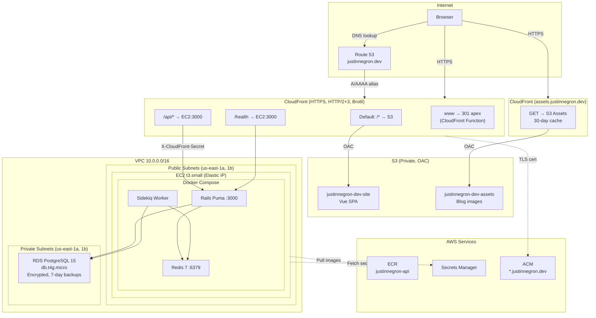
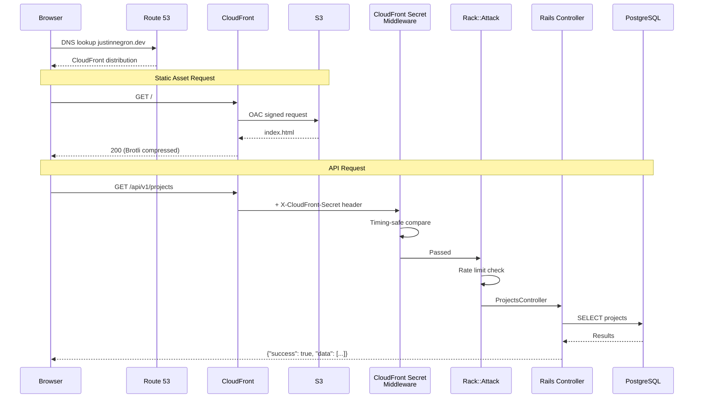
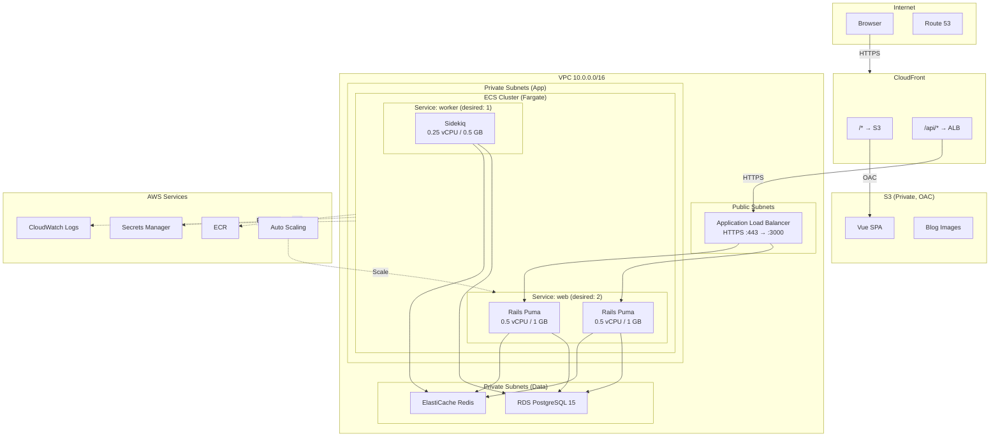

<div align="center">

# justinnegron.dev

**Full-stack portfolio website — Rails API + Vue SPA on AWS**

[](https://justinnegron.dev)
[](https://www.ruby-lang.org/)
[](https://rubyonrails.org/)
[](https://vuejs.org/)
[](https://www.typescriptlang.org/)
[](https://tailwindcss.com/)
[](https://www.terraform.io/)
[](https://circleci.com/)
[]()
[]()

</div>

---

A production-grade portfolio and blog platform built as a monorepo. The Rails 7 API backend serves structured data to a Vue 3 single-page application, with all infrastructure provisioned via Terraform on AWS. Features include a full admin dashboard with JWT authentication, a CodeMirror 6 markdown blog editor with S3 image uploads, an interactive floating terminal, and a customizable appearance system.

<br>

## Table of Contents

- [Architecture](#architecture)
- [Tech Stack](#tech-stack)
- [Features](#features)
- [Project Structure](#project-structure)
- [Getting Started](#getting-started)
- [Development](#development)
- [Testing](#testing)
- [Deployment](#deployment)
- [Infrastructure](#infrastructure)
- [System Design](#system-design)
- [Fargate Migration Path](#fargate-migration-path)
- [API Reference](#api-reference)
- [License](#license)

<br>

## Architecture

```
┌─────────────────────────────────────────────────────────────────┐
│                          CloudFront                             │
│                     justinnegron.dev                            │
│                                                                 │
│   ┌──────────────┐    ┌──────────────┐    ┌──────────────┐     │
│   │  /* (SPA)    │    │  /api/*      │    │  /health     │     │
│   │  S3 Origin   │    │  EC2 Origin  │    │  EC2 Origin  │     │
│   └──────┬───────┘    └──────┬───────┘    └──────┬───────┘     │
└──────────┼───────────────────┼───────────────────┼─────────────┘
           │                   │                   │
    ┌──────▼───────┐    ┌──────▼───────────────────▼──────┐
    │   S3 Bucket  │    │          EC2 (t3.small)         │
    │  Vue SPA     │    │  ┌─────────┐  ┌───────┐        │
    │  (private,   │    │  │  Rails  │  │Sidekiq│        │
    │   OAC)       │    │  │  Puma   │  │       │        │
    └──────────────┘    │  │  :3000  │  │       │        │
                        │  └────┬────┘  └───┬───┘        │
                        │       │           │             │
                        │  ┌────▼───────────▼────┐       │
                        │  │     Redis :6379      │       │
                        │  │   (jobs + cache)     │       │
                        │  └─────────────────────┘       │
                        └──────────────┬─────────────────┘
                                       │
                              ┌────────▼────────┐
                              │  RDS PostgreSQL  │
                              │  (private subnet)│
                              │  db.t4g.micro    │
                              └─────────────────┘
```

<br>

## Tech Stack

### Backend

| Technology | Version | Purpose |
|-----------|---------|---------|
| Ruby | 3.4.8 | Language |
| Rails | 7.1.6 | API-only framework |
| PostgreSQL | 15 | Primary database |
| Redis | 7 | Job queue and cache |
| Sidekiq | 7.3 | Background job processor |
| Puma | 6.x | Application server |
| Alba | 3.3 | JSON serialization |
| Kaminari | 1.2 | Pagination |
| JWT | 3.1 | Authentication tokens |
| Rack::Attack | — | Rate limiting |
| RSpec | 6.0 | Test framework (261 specs) |

### Frontend

| Technology | Version | Purpose |
|-----------|---------|---------|
| Vue.js | 3.5 | Composition API SPA |
| TypeScript | 5.9 | Strict mode throughout |
| Vite | 7.3 | Build tool and dev server |
| Tailwind CSS | 4.1 | CSS-first configuration |
| Pinia | 2.2 | State management (5 stores) |
| Vue Router | 4.4 | Client-side routing |
| Axios | 1.7 | HTTP client |
| CodeMirror 6 | — | Markdown blog editor |
| marked + DOMPurify | — | Markdown rendering + XSS prevention |
| VeeValidate + Yup | — | Form validation |
| Vitest | 2.1 | Unit test framework |

### Infrastructure

| Technology | Purpose |
|-----------|---------|
| Terraform | Infrastructure as code |
| AWS CloudFront | CDN, HTTPS termination, API proxy |
| AWS S3 | SPA hosting, blog image assets |
| AWS EC2 | Application server (Docker) |
| AWS RDS | Managed PostgreSQL |
| AWS ECR | Docker image registry |
| AWS Secrets Manager | Environment variables |
| AWS Route 53 | DNS management |
| AWS ACM | TLS certificates |
| Docker | Container runtime |
| CircleCI | CI pipeline |

<br>

## Features

### Public Site
- **Home** — Animated hero with 3 canvas backgrounds (flow field, geometric drift, constellations)
- **Projects** — Responsive grid with featured projects, tech tags, and staggered reveal animations
- **Experience** — Timeline with Work/Education toggle, sliding pill indicator, alternating layout
- **Blog** — Listing with tag filtering, individual post reader with reading progress bar
- **Contact** — Terminal-themed split layout with server-side validation
- **About** — Photo viewer with bio and resume download

### Interactive Terminal
- Floating, draggable terminal component (~1250 lines)
- Docks into hero slot or floats freely anywhere on the page
- Commands: navigation, links, theming (`skin`, `bg`), `clear`, `help`
- Tab autocomplete, ArrowUp/Down history traversal
- Auto-types on hover from header, footer, and CTA buttons

### Appearance System
- 4 color skins: Amber, Ocean, Rose, Sage (15+ CSS variables each)
- 3 animated canvas backgrounds
- Light/dark mode with View Transitions API circular reveal
- All preferences persisted to localStorage

### Admin Dashboard
- JWT authentication with httpOnly refresh token rotation
- Full CRUD for Projects, Experiences, Blog Posts, Contacts
- Analytics dashboard with stats, views-by-date chart, popular pages
- CodeMirror 6 markdown editor with toolbar, side-by-side live preview
- S3 presigned URL image uploads with drag-and-drop and clipboard paste
- Auto-save drafts to localStorage

### Security
- CloudFront secret header middleware (timing-safe comparison)
- Rack::Attack rate limiting on all sensitive endpoints
- CORS restricted to production domain
- Force SSL with HSTS
- Security headers (X-Content-Type-Options, X-Frame-Options, CSP, Referrer-Policy)
- DOMPurify sanitization on all rendered markdown
- IMDSv2 enforced on EC2
- RDS in private subnets, encrypted at rest
- ECR image scanning on push

<br>

## Project Structure

```
.
├── backend/                    # Rails 7.1.6 API
│   ├── app/
│   │   ├── controllers/api/v1/ # Versioned API controllers
│   │   │   ├── admin/          # Auth, CRUD, analytics, uploads
│   │   │   ├── base_controller.rb
│   │   │   ├── projects_controller.rb
│   │   │   ├── experiences_controller.rb
│   │   │   ├── blog_posts_controller.rb
│   │   │   ├── contacts_controller.rb
│   │   │   └── analytics/
│   │   ├── models/             # Project, Experience, BlogPost, Contact, PageView, Admin
│   │   ├── resources/          # Alba JSON serialization
│   │   ├── services/           # JwtService, S3PresignService
│   │   ├── middleware/         # CloudfrontSecretMiddleware
│   │   └── jobs/               # EmailNotificationJob
│   ├── config/
│   │   ├── routes.rb           # /api/v1/ namespace
│   │   └── initializers/       # CORS, Rack::Attack, security headers, AWS
│   ├── spec/                   # 261 RSpec tests, 96.3% coverage
│   └── Dockerfile              # Multi-stage, non-root, jemalloc
│
├── frontend/                   # Vue 3.5 + TypeScript SPA
│   ├── src/
│   │   ├── views/              # HomeView, BlogView, BlogPostView, AboutView, NotFoundView
│   │   ├── views/admin/        # Login, Dashboard, CRUD forms (10 views)
│   │   ├── components/         # hero/, projects/, experience/, about/, contact/, blog/,
│   │   │                       # layout/, terminal/, admin/
│   │   ├── stores/             # 5 public + 5 admin Pinia stores + auth store
│   │   ├── services/           # API layer (typed Axios wrappers)
│   │   ├── composables/        # useApi, useHead, useTheme, useAppearance,
│   │   │                       # useImageUpload, useDraftAutoSave
│   │   ├── types/              # models.ts, api.ts (mirrors Alba output)
│   │   ├── layouts/            # AdminLayout.vue
│   │   └── assets/styles/      # Tailwind CSS 4 (CSS-first config)
│   └── index.html
│
├── infra/                      # Terraform (AWS)
│   ├── network.tf              # VPC, subnets, security groups
│   ├── compute.tf              # EC2, IAM, key pair
│   ├── database.tf             # RDS PostgreSQL
│   ├── site.tf                 # S3 + CloudFront (SPA + API proxy)
│   ├── assets.tf               # S3 + CloudFront (blog images)
│   ├── dns.tf                  # Route 53 + ACM certificates
│   ├── ecr.tf                  # Docker image registry
│   ├── secrets.tf              # Secrets Manager
│   └── templates/user-data.sh  # EC2 bootstrap script
│
├── scripts/                    # Deploy scripts (local only, not tracked)
├── docs/                       # PROGRESS.md, CONTENT.md
└── .circleci/config.yml        # CI pipeline
```

<br>

## Getting Started

### Prerequisites

- Ruby 3.4.8 (via rbenv)
- Node.js >= 20.0.0
- PostgreSQL 15
- Redis 7

### Backend Setup

```bash
cd backend

# Install dependencies
bundle install

# Start PostgreSQL and Redis (WSL2)
sudo service postgresql start
sudo service redis-server start

# OR with Docker
docker compose up -d

# Set up database
cp .env.example .env.development.local  # Edit with your values
bin/rails db:create db:migrate db:seed

# Start the server
bin/rails server  # http://localhost:3000
```

### Frontend Setup

```bash
cd frontend

# Install dependencies
npm install

# Start dev server (proxies /api to Rails on :3000)
npm run dev  # http://localhost:5173
```

### Full Dev Environment (4 terminals)

```
Terminal 1: cd backend && bin/rails server
Terminal 2: cd backend && bundle exec sidekiq
Terminal 3: cd frontend && npm run dev
Terminal 4: Working terminal for git/tests
```

<br>

## Development

### Backend Commands

```bash
bin/rails server                              # Start Rails on :3000
bin/rails console                             # Interactive console
bin/rails routes                              # List all routes
bundle exec sidekiq                           # Background job processor
```

### Frontend Commands

```bash
npm run dev          # Vite dev server with HMR
npm run build        # TypeScript check + production build
npm run typecheck    # vue-tsc only
npm run lint         # ESLint with auto-fix
npm run format       # Prettier
```

### Code Conventions

- **Backend**: Alba resources for serialization (not AMS), blog posts use `slug` not `id`
- **Frontend**: `<script setup lang="ts">`, path aliases (`@/`, `@components/`, `@stores/`, etc.)
- **CSS**: Tailwind CSS 4 CSS-first config, dark mode via `:is(.dark *)` pattern in scoped styles
- **Formatting**: Prettier 100 width, no semicolons, single quotes (`.prettierrc.cjs`)

<br>

## Testing

### Backend

```bash
cd backend
bundle exec rspec                             # All 261 tests
bundle exec rspec spec/models/                # By directory
bundle exec rspec spec/models/project_spec.rb # Single file
bundle exec rspec spec/models/project_spec.rb:10  # Single test by line
```

**Coverage**: 96.3% line coverage, 82.4% branch coverage (SimpleCov).

### Frontend

```bash
cd frontend
npm test                                      # Vitest
npx vitest run src/components/__tests__/HelloWorld.spec.ts  # Single file
```

### CI Pipeline

CircleCI runs on every push and pull request:

- **Backend**: PostgreSQL 15 + Redis 7 services, schema load, RSpec, `bundler-audit`, `brakeman`
- **Frontend**: TypeScript check, ESLint, Prettier, Vitest, `npm audit`, Vite build

<br>

## Deployment

### Frontend

Builds the Vue SPA, syncs to S3 with cache headers, and invalidates CloudFront:

```bash
./scripts/deploy-frontend.sh
```

### Backend

Builds the Docker image, pushes to ECR, then SSH into EC2 to pull and restart:

```bash
./scripts/deploy-backend.sh
ssh ec2-user@<EC2_IP> "sudo /opt/app/deploy.sh"
```

### Infrastructure

All AWS resources are managed with Terraform:

```bash
cd infra
terraform init      # First time only
terraform plan      # Preview changes
terraform apply     # Apply changes
```

<br>

## Infrastructure

### AWS Resources

| Service | Resource | Purpose |
|---------|----------|---------|
| CloudFront | 2 distributions | SPA + API proxy, blog image CDN |
| S3 | 2 buckets (private) | SPA static files, blog images |
| EC2 | t3.small | Docker host (Rails + Sidekiq + Redis) |
| RDS | db.t4g.micro, PostgreSQL 15 | Primary database (private subnet) |
| ECR | justinnegron-api | Docker image registry |
| Secrets Manager | 1 secret (JSON) | All app environment variables |
| Route 53 | Hosted zone | DNS for apex, www, assets subdomains |
| ACM | Wildcard cert | TLS for *.justinnegron.dev + apex |
| VPC | 10.0.0.0/16 | 2 public + 2 private subnets |

### Estimated Monthly Cost

| Service | Cost |
|---------|------|
| EC2 (t3.small) | ~$15 |
| RDS (db.t4g.micro, free tier yr 1) | Free → ~$15 |
| S3 + CloudFront | ~$2 |
| Route 53 | ~$0.50 |
| Secrets Manager | ~$2 |
| ECR | ~$1 |
| **Total (year 1)** | **~$18/month** |
| **Total (after free tier)** | **~$33/month** |

### Security Layers

1. **Network**: EC2 security group restricted to CloudFront IP ranges (AWS managed prefix list)
2. **Application**: `X-CloudFront-Secret` header verified by Rails middleware (timing-safe)
3. **Transport**: Force SSL, TLS 1.2+, HSTS via CloudFront
4. **API**: JWT access tokens (15 min), httpOnly refresh cookies (7 day, strict SameSite)
5. **Rate Limiting**: Rack::Attack — login 5/15m, contacts 5/15m, refresh 10/1m, global 300/5m
6. **Data**: RDS encrypted at rest, private subnets, no public access. IMDSv2 on EC2.

<br>

## System Design

### Current Architecture (EC2 + Docker Compose)



### Request Flow



<br>

## Fargate Migration Path

The current EC2 + Docker Compose setup is optimized for cost and simplicity. If traffic grows or zero-downtime deployments become necessary, the architecture can migrate to ECS Fargate without changing any application code.

### What Changes

| Component | Current (EC2) | Future (Fargate) |
|-----------|--------------|-------------------|
| Compute | Single EC2 t3.small | ECS Fargate tasks (serverless) |
| Load balancing | CloudFront → EC2 direct | CloudFront → ALB → Fargate |
| Scaling | Manual (SSH + restart) | Auto-scaling (CPU/memory) |
| Deploys | `deploy.sh` → SSH pull | ECS rolling update (zero-downtime) |
| Redis | Docker container on EC2 | ElastiCache (managed) |
| Cost | ~$33/mo | ~$106/mo |

### Fargate Architecture



### Migration Steps

1. **Add ALB** — Application Load Balancer in public subnets with HTTPS listener
2. **Create ECS Cluster** — Fargate launch type, no EC2 instances to manage
3. **Define Task Definitions** — Separate tasks for `web` (Rails) and `worker` (Sidekiq)
4. **Create ECS Services** — `web` with ALB target group, `worker` standalone
5. **Provision ElastiCache** — Redis cluster in private subnets (replaces Docker Redis)
6. **Update CloudFront** — Change API origin from EC2 IP to ALB DNS name
7. **Add Auto Scaling** — Target tracking on CPU utilization (scale at 70%)
8. **Add NAT Gateway** — Required for Fargate tasks in private subnets to reach ECR
9. **Decommission EC2** — Once Fargate services are healthy, terminate the instance

### Cost Comparison

| Component | EC2 (Current) | Fargate (Migrated) |
|-----------|--------------|-------------------|
| Compute | EC2 t3.small: $15 | 2x web + 1x worker: ~$25 |
| Load Balancer | — (CloudFront direct) | ALB: ~$16 |
| Redis | Docker (free on EC2) | ElastiCache t4g.micro: ~$12 |
| NAT Gateway | — | ~$32 |
| RDS | ~$15 | ~$15 (unchanged) |
| Other (S3, CF, R53, SM, ECR) | ~$6 | ~$6 |
| **Total** | **~$33/mo** | **~$106/mo** |

> **Note**: The NAT Gateway ($32/mo) is the largest cost increase. Alternatives: VPC endpoints for ECR/S3/Secrets Manager (~$7/mo each), or Fargate in public subnets with `assign_public_ip = true` (eliminates NAT cost, slightly less secure).

<br>

## API Reference

All endpoints return a standardized JSON envelope:

```json
{
  "success": true,
  "data": { ... },
  "meta": { "current_page": 1, "total_pages": 1, "total_count": 10 }
}
```

### Public Endpoints

| Method | Path | Description |
|--------|------|-------------|
| `GET` | `/api/v1/projects` | List projects (`?featured=true` supported) |
| `GET` | `/api/v1/projects/:id` | Get project by ID |
| `GET` | `/api/v1/experiences` | List all experiences |
| `GET` | `/api/v1/blog_posts` | List published blog posts |
| `GET` | `/api/v1/blog_posts/:slug` | Get blog post by slug |
| `POST` | `/api/v1/contacts` | Submit contact form |
| `POST` | `/api/v1/analytics/track` | Track page view |

### Admin Endpoints (JWT required)

| Method | Path | Description |
|--------|------|-------------|
| `POST` | `/api/v1/admin/auth/login` | Authenticate |
| `POST` | `/api/v1/admin/auth/refresh` | Refresh access token |
| `DELETE` | `/api/v1/admin/auth/logout` | Logout |
| `GET/POST` | `/api/v1/admin/projects` | List / Create |
| `PUT/DELETE` | `/api/v1/admin/projects/:id` | Update / Delete |
| `GET/POST` | `/api/v1/admin/experiences` | List / Create |
| `PUT/DELETE` | `/api/v1/admin/experiences/:id` | Update / Delete |
| `GET/POST` | `/api/v1/admin/blog_posts` | List / Create |
| `PUT/DELETE` | `/api/v1/admin/blog_posts/:id` | Update / Delete |
| `POST` | `/api/v1/admin/blog_posts/:id/publish` | Publish post |
| `POST` | `/api/v1/admin/blog_posts/:id/unpublish` | Unpublish post |
| `GET` | `/api/v1/admin/contacts` | List contacts |
| `GET/DELETE` | `/api/v1/admin/contacts/:id` | Show / Delete |
| `PATCH` | `/api/v1/admin/contacts/:id/status` | Update status |
| `GET` | `/api/v1/admin/analytics/dashboard` | Dashboard stats |
| `POST` | `/api/v1/admin/uploads/presign` | S3 presigned URL |

<br>

## License

This project is the personal portfolio of Justin Negron. The code is available for reference and learning purposes.
